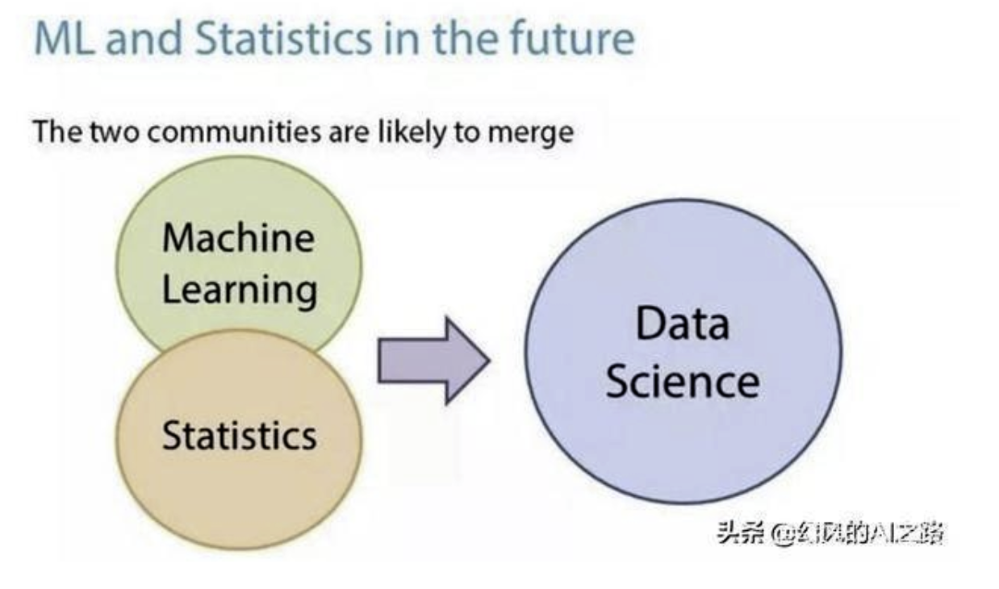
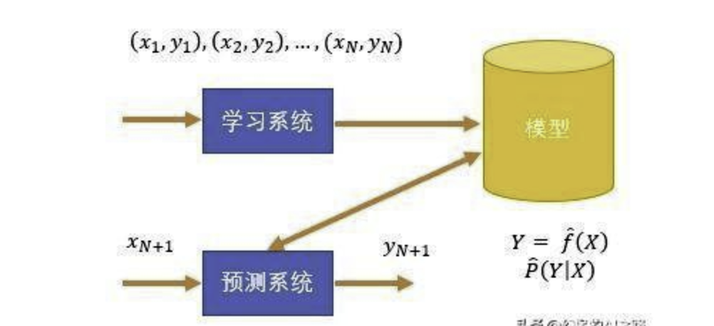
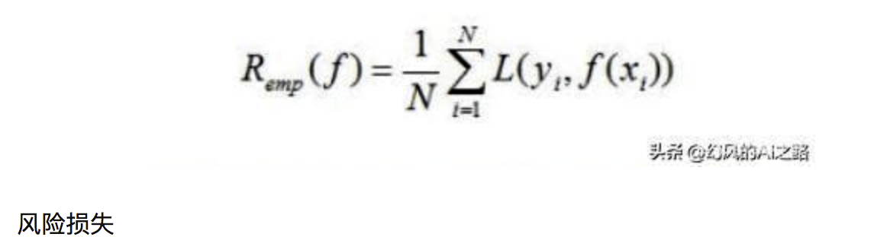
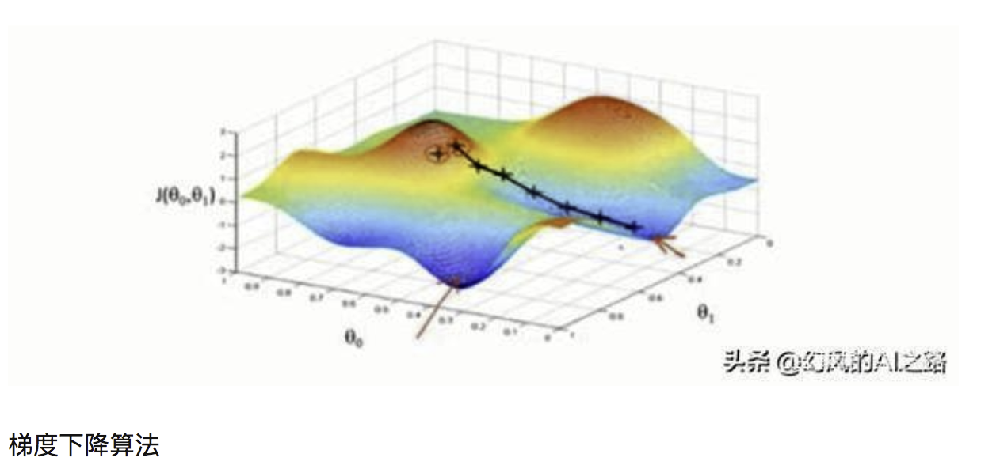

>作者：红色石头

>公众号：AI有道（ID：redstonewill）

最近在看NTU林轩田的《机器学习基石》课程，个人感觉讲的非常好。整个基石课程分成四个部分：

- When Can Machine Learn?

-  Why Can Machine Learn?

- How Can Machine Learn?

- How Can Machine Learn Better?

每个部分由四节课组成，总共有16节课。那么，从这篇开始，我们将连续对这门课做课程笔记，共16篇，希望能对正在看这们课的童鞋有所帮助。下面开始第一节课的笔记：The Learning Problem。

### **一、What is Machine Learning**

什么是“学习”？学习就是人类通过观察、积累经验，掌握某项技能或能力。就好像我们从小学习识别字母、认识汉字，就是学习的过程。而机器学习（Machine Learning），顾名思义，就是让机器（计算机）也能向人类一样，通过观察大量的数据和训练，发现事物规律，获得某种分析问题、解决问题的能力。

机器学习可以被定义为：Improving some performance measure with experence computed from data. 也就是机器从数据中总结经验，从数据中找出某种规律或者模型，并用它来解决实际问题。

什么情况下会使用机器学习来解决问题呢？其实，目前机器学习的应用非常广泛，基本上任何场合都能够看到它的身影。其应用场合大致可归纳为三个条件：

- 事物本身存在某种潜在规律

- 某些问题难以使用普通编程解决

- 有大量的数据样本可供使用

### **二、Applications of Machine Learning**

机器学习在我们的衣、食、住、行、教育、娱乐等各个方面都有着广泛的应用，我们的生活处处都离不开机器学习。比如，打开购物网站，网站就会给我们自动推荐我们可能会喜欢的商品；电影频道会根据用户的浏览记录和观影记录，向不同用户推荐他们可能喜欢的电影等等，到处都有机器学习的影子。

### **三、Components of Machine Learning**

本系列的课程对机器学习问题有一些基本的术语需要注意一下：

- 输入x

- 输出y

- 目标函数f，即最接近实际样本分布的规律

- 训练样本data

- 假设hypothesis，一个机器学习模型对应了很多不同的hypothesis，通过演算法A，选择一个最佳的hypothesis对应的函数称为矩g，g能最好地表示事物的内在规律，也是我们最终想要得到的模型表达式。

实际中，机器学习的流程图可以表示为：

对于理想的目标函数f，我们是不知道的，我们手上拿到的是一些训练样本D，假设是监督式学习，其中有输入x，也有输出y。机器学习的过程，就是根据先验知识选择模型，该模型对应的hypothesis set（用H表示），H中包含了许多不同的hypothesis，通过演算法A，在训练样本D上进行训练，选择出一个最好的hypothes，对应的函数表达式g就是我们最终要求的。一般情况下，g能最接近目标函数f，这样，机器学习的整个流程就完成了。

### **四、Machine Learning and Other Fields**

与机器学习相关的领域有：

- 数据挖掘（Data Mining）

- 人工智能（Artificial Intelligence）

- 统计（Statistics）

其实，机器学习与这三个领域是相通的，基本类似，但也不完全一样。机器学习是这三个领域中的有力工具，而同时，这三个领域也是机器学习可以广泛应用的领域，总得来说，他们之间没有十分明确的界线。

### **五、总结**

本节课主要介绍了什么是机器学习，什么样的场合下可以使用机器学习解决问题，然后用流程图的形式展示了机器学习的整个过程，最后把机器学习和数据挖掘、人工智能、统计这三个领域做个比较。本节课的内容主要是概述性的东西，比较简单，所以笔记也相对比较简略。

这里附上林轩田（Hsuan-Tien Lin）关于这门课的主页：
http://www.csie.ntu.edu.tw/~htlin/

***注明：***

文章中所有的图片均来自台湾大学林轩田《机器学习基石》课程。

##### 附1-模型、策略、算法的区别和联系
统计机器学习是关于计算机基于数据构建概率统计模型并运用模型对数据进行预测与分析的一门学科。统计机器学习通过对已知数据构建模型，从而完成对未知的数据进行预测和分析，预测和分析这种行为可以使得计算机看起来很智能，这就是人工智能的一种体现。统计机器学习的总目标就是考虑学什么样的模型和如何学习模型，以使得模型能够对未知数据进行准确的预测和分析。统计机器学习方法的三要素就是：模型、策略和算法。

机器学习+统计=数据科学

###### 模型
> 统计学习首要考虑的问题是学习什么样的模型。在监督学习过程中，模型就是所要学习的条件概率分布或决策函数。

数据构成假设空间，在这个假设空间中包含所有可能的条件概率分布或者决策函数，每一个条件概率分布或者决策函数对应一个模型，那么这个样本空间中的模型个数有无数个。

怎样理解模型呢？简单来说就是使用什么映射函数来表示特征X和Y标签之间的关系F，F有两种形式：F={f|y=f(x)}或者F={P|P(Y|X)}

F={f|y=f(x)}为决策函数，它表示的模型为非概率模型。F={P|P(Y|X)}是条件概率表示，它的模型为概率模型。

###### 策略
> 策略即从假设空间中挑选出参数最优的模型的准则。模型的分类或预测结果与实际情况的误差(损失函数)越小，模型就越好。

我们前面已经知道在样本空间中有无数的模型，但模型有好有坏，现在的问题考虑的是按照什么样的准则学习或者选择最优模型，而策略就是通过引入损失函数的方式来度量模型的好坏。

设定损失函数，这样监督学习问题就变成了最小化损失函数，那么按照这样的策略，就可以求解出最优化的模型了。

###### 算法
> 算法是指学习模型的具体计算方法，也就是如何求解全局最优解，并使得这个过程高效而且准确，本质上就是计算机算法，怎么去求数学问题的最优化解。

前面我们知道了模型有无数种，获取最好模型的方法就是最小化损失函数，那么此时的模型就是最好的，现在的问题就是如何才能获取到这个最优化的解呢？是正规方程还是梯度下降等等。

###### 总结
统计机器学习基于训练数据集，根据学习策略，从假设空间中选择最优模型、最后需要考虑用什么样的计算方法求解最优模型，所以我们可以认为统计机器学习都是由模型、策略和算法构成的。统计学习方法之间的不同，主要来自其模型、策略、算法的不同。确定了模型、策略、算法，统计学习的方法也就确定了。
