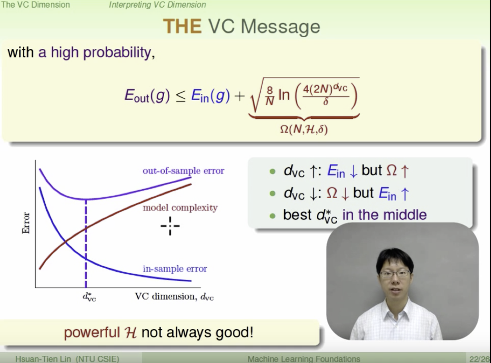

>作者：红色石头

>公众号：AI有道（ID：redstonewill）

前几节课着重介绍了机器能够学习的条件并做了详细的推导和解释。机器能够学习必须满足两个条件：

- **假设空间H的Size M是有限的，即当N足够大的时候，那么对于假设空间中任意一个假设g，$E_{out}\approx E_{in}$**。
- **利用算法A从假设空间H中，挑选一个g，使$E_{in}(g)\approx0$，则$E_{out}\approx0$**。

这两个条件，正好对应着test和trian两个过程。train的目的是使损失期望$E_{in}(g)\approx0$；test的目的是使将算法用到新的样本时的损失期望也尽可能小，即$E_{out}\approx0$。

正因为如此，上次课引入了break point，并推导出只要break point存在，则M有上界，一定存在$E_{out}\approx E_{in}$。

本次笔记主要介绍VC Dimension的概念。同时也是总结VC Dimension与$E_{in}(g)\approx0$，$E_{out}\approx0$，Model Complexity Penalty（下面会讲到）的关系。

###**一、Definition of VC Dimension**

首先，我们知道如果一个假设空间H有break point k，那么它的成长函数是有界的，它的上界称为Bound function。根据数学归纳法，Bound function也是有界的，且上界为$N^{k-1}$。从下面的表格可以看出，$N(k-1)$比B(N,k)松弛很多。

则根据上一节课的推导，VC bound就可以转换为：

这样，不等式只与k和N相关了，一般情况下样本N足够大，所以我们只考虑k值。有如下结论：

- **若假设空间H有break point k，且N足够大，则根据VC bound理论，算法有良好的泛化能力**

- **在假设空间中选择一个矩g，使$E_{in}\approx0$，则其在全集数据中的错误率会较低**

下面介绍一个新的名词：VC Dimension。VC Dimension就是某假设集H能够shatter的最多inputs的个数，即最大完全正确的分类能力。（注意，只要存在一种分布的inputs能够正确分类也满足）。

shatter的英文意思是“粉碎”，也就是说对于inputs的所有情况都能列举出来。例如对N个输入，如果能够将$2^N$种情况都列出来，则称该N个输入能够被假设集H shatter。

根据之前break point的定义：假设集不能被shatter任何分布类型的inputs的最少个数。则VC Dimension等于break point的个数减一。

现在，我们回顾一下之前介绍的四种例子，它们对应的VC Dimension是多少：

用$d_{vc}$代替k，那么VC bound的问题也就转换为与$d_{vc}$和N相关了。同时，如果一个假设集H的$d_{vc}$确定了，则就能满足机器能够学习的第一个条件$E_{out}\approx E_{in}$，与算法、样本数据分布和目标函数都没有关系。

###**二、VC Dimension of Perceptrons **

回顾一下我们之前介绍的2D下的PLA算法，已知Perceptrons的k=4，即$d_{vc}=3$。根据VC Bound理论，当N足够大的时候，$E_{out}(g)\approx E_{in}(g)$。如果找到一个g，使$E_{in}(g)\approx 0$，那么就能证明PLA是可以学习的。

这是在2D情况下，那如果是多维的Perceptron，它对应的$d_{vc}$又等于多少呢？

已知在1D Perceptron，$d_{vc}=2$，在2D Perceptrons，$d_{vc}=3$，那么我们有如下假设：$d_{vc}=d+1$，其中d为维数。

要证明的话，只需分两步证明：

- $d_{vc}\geq d+1$
- $d_{vc}\leq d+1$

首先证明第一个不等式：$d_{vc}\geq d+1$。

在d维里，我们只要找到某一类的d+1个inputs可以被shatter的话，那么必然得到$d_{vc}\geq d+1$。所以，我们有意构造一个d维的矩阵$X$能够被shatter就行。$X$是d维的，有d+1个inputs，每个inputs加上第零个维度的常数项1，得到$X$的矩阵：

矩阵中，每一行代表一个inputs，每个inputs是d+1维的，共有d+1个inputs。这里构造的$X$很明显是可逆的。shatter的本质是假设空间H对$X$的所有情况的判断都是对的，即总能找到权重W，满足$X\ast W=y$，$W=X^{-1}\ast y$。由于这里我们构造的矩阵$X$的逆矩阵存在，那么d维的所有inputs都能被shatter，也就证明了第一个不等式。

然后证明第二个不等式：$d_{vc}\leq d+1$。

在d维里，如果对于任何的d+2个inputs，一定不能被shatter，则不等式成立。我们构造一个任意的矩阵$X$，其包含d+2个inputs，该矩阵有d+1列，d+2行。这d+2个向量的某一列一定可以被另外d+1个向量线性表示，例如对于向量$X_{d+2}$，可表示为：
$$X_{d+2}=a_1\ast X_1+a_2\ast X_2+\cdots+a_d\ast X_d$$

其中，假设$a_1>0$，$a_2,\cdots,a_d<0$.

那么如果$X_1$是正类，$X_2,\cdots,X_d$均为负类，则存在$W$，得到如下表达式：
$X_{d+2}\ast W=$$a_1\ast X_1\ast W$+$a_2\ast X_2\ast W$+$\cdots$+$a_d\ast X_d\ast W$$>0$

因为其中蓝色项大于0，代表正类；红色项小于0，代表负类。所有对于这种情况，$X_d+2$一定是正类，无法得到负类的情况。也就是说，d+2个inputs无法被shatter。证明完毕！

综上证明可得$d_{vc}=d+1$。

###**三、Physical Intuition VC Dimension**

上节公式中$W$又名features，即自由度。自由度是可以任意调节的，如同上图中的旋钮一样，可以调节。VC Dimension代表了假设空间的分类能力，即反映了H的自由度，产生dichotomy的数量，也就等于features的个数，但也不是绝对的。

例如，对2D Perceptrons，线性分类，$d_{vc}=3$，则$W=\{w_0,w_1,w_2\}$，也就是说只要3个features就可以进行学习，自由度为3。

介绍到这，我们发现M与$d_{vc}$是成正比的，从而得到如下结论：

###**四、Interpreting VC Dimension**

下面，我们将更深入地探讨VC Dimension的意义。首先，把VC Bound重新写到这里：

根据之前的泛化不等式，如果$|E_{in}-E_{out}|>\epsilon$，即出现bad坏的情况的概率最大不超过$\delta$。那么反过来，对于good好的情况发生的概率最小为$1-\delta$，则对上述不等式进行重新推导：

$\epsilon$表现了假设空间H的泛化能力，$\epsilon$越小，泛化能力越大。

至此，已经推导出泛化误差$E_{out}$的边界，因为我们更关心其上界（$E_{out}$可能的最大值），即：

上述不等式的右边第二项称为模型复杂度，其模型复杂度与样本数量N、假设空间H($d_{vc}$)、$\epsilon$有关。$E_{out}$由$E_{in}$共同决定。下面绘出$E_{out}$、model complexity、$E_{in}$随$d_{vc}$变化的关系：

通过该图可以得出如下结论：

- **$d_{vc}$越大，$E_{in}$越小，$\Omega$越大（复杂）**。

- **$d_{vc}$越小，$E_{in}$越大，$\Omega$越小（简单）**。

- **随着$d_{vc}$增大，$E_{out}$会先减小再增大**。

所以，为了得到最小的$E_{out}$，不能一味地增大$d_{vc}$以减小$E_{in}$，因为$E_{in}$太小的时候，模型复杂度会增加，造成$E_{out}$变大。也就是说，选择合适的$d_{vc}$，选择的features个数要合适。

下面介绍一个概念：样本复杂度（Sample Complexity）。如果选定$d_{vc}$，样本数据D选择多少合适呢？通过下面一个例子可以帮助我们理解：

通过计算得到N=29300，刚好满足$\delta=0.1$的条件。N大约是$d_{vc}$的10000倍。这个数值太大了，实际中往往不需要这么多的样本数量，大概只需要$d_{vc}$的10倍就够了。N的理论值之所以这么大是因为VC Bound 过于宽松了，我们得到的是一个比实际大得多的上界。

值得一提的是，VC Bound是比较宽松的，而如何收紧它却不是那么容易，这也是机器学习的一大难题。但是，令人欣慰的一点是，VC Bound基本上对所有模型的宽松程度是基本一致的，所以，不同模型之间还是可以横向比较。从而，VC Bound宽松对机器学习的可行性还是没有太大影响。

###**五、总结**

本节课主要介绍了VC Dimension的概念就是最大的non-break point。然后，我们得到了Perceptrons在d维度下的VC Dimension是d+1。接着，我们在物理意义上，将$d_{vc}$与自由度联系起来。最终得出结论$d_{vc}$不能过大也不能过小。选取合适的值，才能让$E_{out}$足够小，使假设空间H具有良好的泛化能力。

该图解释了，在一个很高维的空间里面，会使训练模型的误差很小，但是在验证集上模型的误差确实很大的。

***注明：***

文章中所有的图片均来自台湾大学林轩田《机器学习基石》课程
